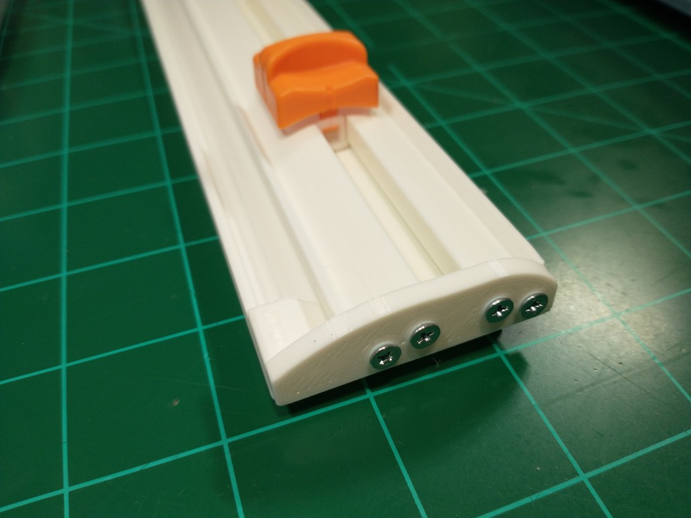

# Paper Cutter

This is a straight edge paper cutter that uses a commonly available "Paper trimmer replacement blades" on eBay/Amazon and arts and crafts stores in your area. Just search for "paper trimmer blades".

This cutter works with the WORKLION, Firbon, LETION paper trimmer blades. Fiskars and other are not tested and probably will not work with those.

## Printing Instructions

I wanted to design it so it could print on the majority of printers out there. Therefore it will print on a standard 210x210 print bed if printed diagonally.

The cutter should be printed in parts.

The 3mf files are available to help with mirror imaging and rotation.

### Hinge Body

This is the main body of the cutter. Print as normal

### Rail Body

This is the rail which the blade rides on. Only one stl/3mf file is available. The part should be mirrored in your slicer software to print the other half of the rail.

### Rail End

Use the 3mf file instead of STL to save some sanity. The mirroring is already done for you.

## Assembly

Use four M3 screws

## How to cut paper

1. Open the bar, insert paper and place it under the bar
2. Make sure the paper is fixed by your fingers and the bar
3. Pressing down the orange slider block and sliding it up and down along the bar;
4. Remove paper from trimmer by raising the bar

## Design files and Tips

The FreeCAD files are available please feel free to remix and post CAD files with your designs improvements. I just got the ball rolling on it and am very interested in what you guys can come up with.

The FreeCAD assembly workbench plugin was used. The paper_cutter.FCStd is the main assembly file that shows all the parts fitting together. Its purely for hole placement and overall fine tuning of the assembly. The design should be edited using individual part files like hinge.FCStd and rail.FCStd etc...

The FreeCAD files are also available on my github site at [https://github.com/numberformat/paper_cutter](https://github.com/numberformat/paper_cutter) Check it out and also visit [https://wiki.noami.us](https://wiki.noami.us) to see my other projects.
